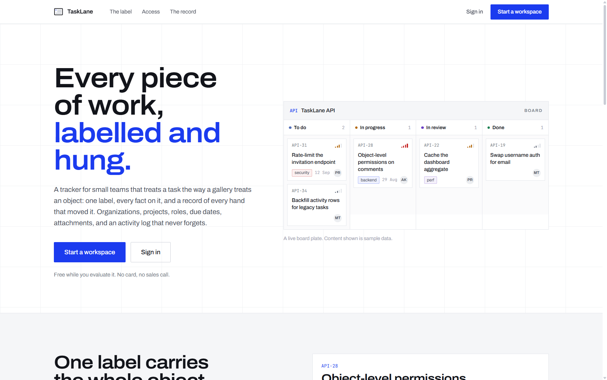
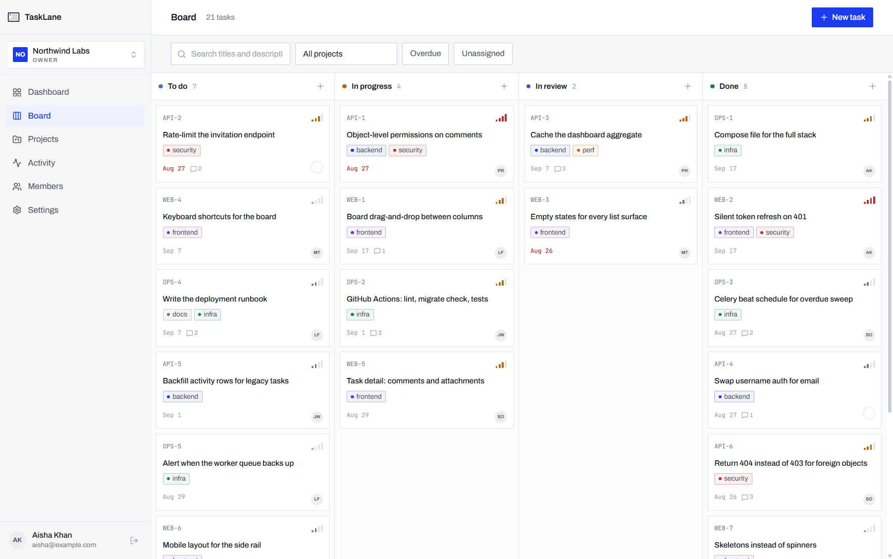
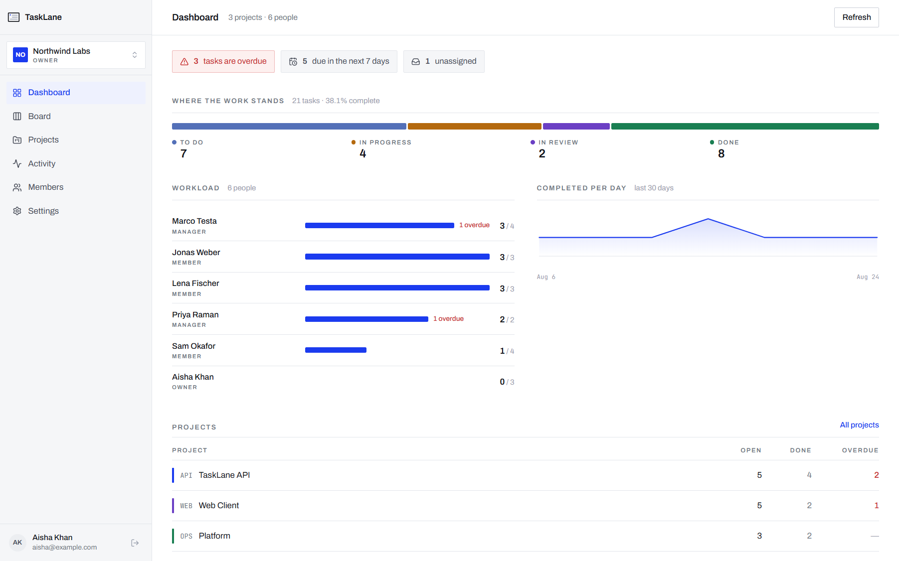
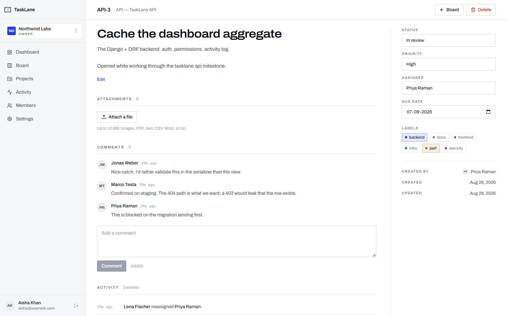
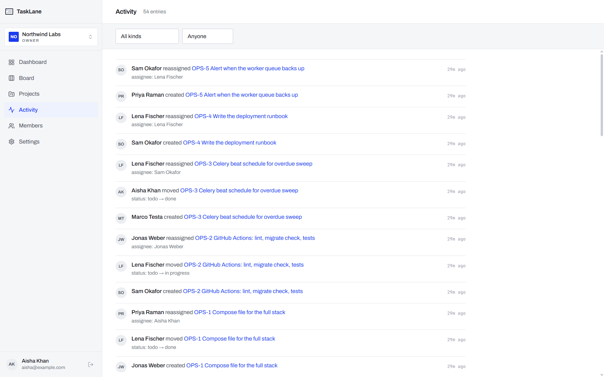
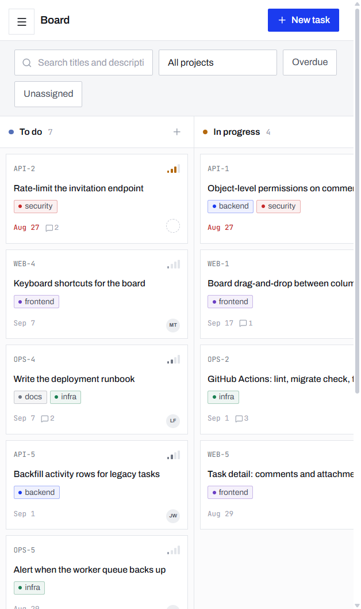
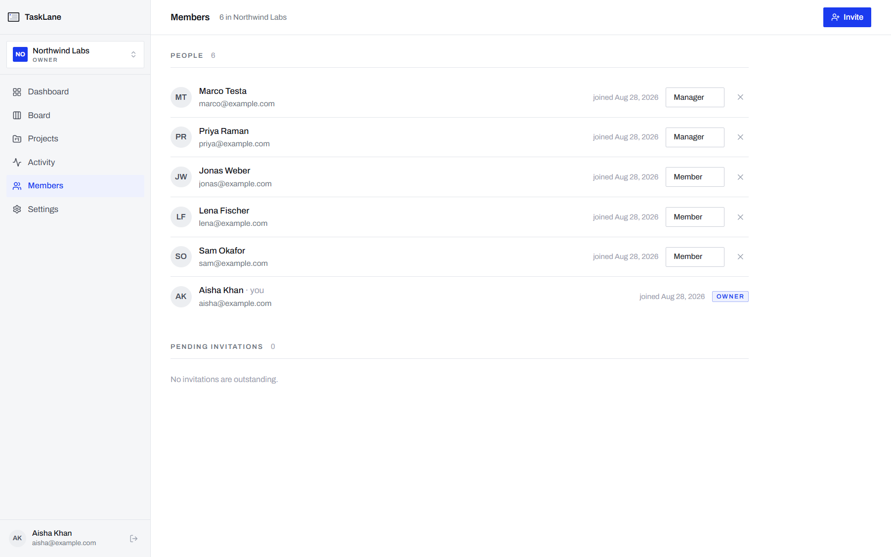

<div align="center">

# TaskLane

**A Jira-lite work tracker for small teams.**
Organizations hold projects, projects hold tasks, and every status change, reassignment
and comment is written to an append-only activity log that nobody can quietly rewrite.

[](https://github.com/VishnuDatta510/Tasklane/actions/workflows/ci.yml)




</div>

---

## What it does

TaskLane is a multi-tenant task tracker. You create an organization, invite people into it
with a role, group work into projects, and move tasks across a board. The parts that are
usually an afterthought — authorization, the audit trail, and background email — are the
parts this project is actually about.

| | |
|---|---|
| **Multi-tenancy** | Every record belongs to exactly one organization. A non-member gets a `404`, not a `403`, so they never learn the row exists. |
| **Three roles** | Member, Manager, Owner — enforced on the server for every request, not by hiding buttons. |
| **Board** | Drag-and-drop across four columns, with optimistic updates that roll back if the server disagrees. |
| **Task detail** | Status, priority, assignee, due date, labels, comments and file attachments on one page. |
| **Activity log** | Append-only. Who, which field, from what, to what, when. Filterable by person and kind. |
| **Dashboard** | Cached aggregate: status split, per-person workload, overdue counts, 30-day completion trend. |
| **Background work** | Celery sends assignment and invitation email off the request path; Beat sweeps for overdue tasks hourly. |
| **Documented API** | OpenAPI schema generated from the code, with CI failing the build if it drifts. |

---

## Screens

<table>
<tr>
<td width="50%"><br><sub><b>Board</b> — filter by project, overdue or unassigned; drag between columns.</sub></td>
<td width="50%"><br><sub><b>Dashboard</b> — where the work stands, who is carrying it, what is late.</sub></td>
</tr>
<tr>
<td width="50%"><br><sub><b>Task detail</b> — one label carrying every fact, plus comments and its own history.</sub></td>
<td width="50%"><br><sub><b>Activity</b> — the full org-wide record, filterable by kind and person.</sub></td>
</tr>
</table>

<div align="center">

<br><sub>The board collapses to a single scrolling column on a phone.</sub>
</div>

---

## Stack

**Backend** — Django 5.2, Django REST Framework, PostgreSQL 17, Celery + Redis, SimpleJWT,
drf-spectacular, pytest, Ruff.

**Frontend** — Next.js 16 (App Router), React 19, TypeScript, Tailwind v4, dnd-kit.

**Infrastructure** — Docker Compose for the whole stack, GitHub Actions for lint, migration
drift, schema drift, tests and image builds.

---

## Run it

> First time here? [SETUP.md](SETUP.md) covers the things no script can do for you —
> secrets, database, email.

### Everything in Docker

```bash
cp backend/.env.example backend/.env
echo "SECRET_KEY=$(python -c 'import secrets;print(secrets.token_urlsafe(50))')" > .env
docker compose up --build
```

| Surface | URL |
|---|---|
| Frontend | http://localhost:3000 |
| API | http://localhost:8000/api/ |
| Swagger UI | http://localhost:8000/api/docs/ |
| ReDoc | http://localhost:8000/api/redoc/ |
| Django admin | http://localhost:8000/admin/ |

### Day-to-day development

Dependencies in containers, app processes on the host, so reloads are instant.

```bash
# 1. Postgres + Redis
docker compose -f docker-compose.dev.yml up -d

# 2. Backend
cd backend
python -m venv .venv && .venv/Scripts/activate      # Windows
# source .venv/bin/activate                          # macOS / Linux
pip install -r requirements.txt -r requirements-dev.txt
cp .env.example .env                                 # then set SECRET_KEY
python manage.py migrate
python manage.py seed_demo                           # optional demo data
python manage.py runserver 8000

# 3. Frontend (separate terminal)
cd frontend
npm install
npm run dev
```

`seed_demo` builds the organization shown in the screenshots. Password `tracker-demo-2026`:

| Email | Role |
|---|---|
| aisha@example.com | Owner |
| marco@example.com | Manager |
| jonas@example.com | Member |

### Background work

Celery only runs when a worker does. `docker compose up` starts one; on the host:

```bash
cd backend
celery -A config worker --loglevel=info      # assignment + invitation email
celery -A config beat   --loglevel=info      # hourly overdue sweep, daily digest
```

Email uses the console backend by default, so it prints in the worker log.

---

## API

Everything lives under `/api/`. JWT in an `Authorization: Bearer` header.

| Area | Endpoints |
|---|---|
| Auth | `POST /auth/register/` · `POST /auth/token/` · `POST /auth/token/refresh/` · `GET /auth/me/` · `POST /auth/change-password/` |
| Organizations | `/organizations/` · `/organizations/{id}/members/` · `/organizations/{id}/invitations/` |
| Invitations | `/my-invitations/` · `POST /invitations/accept/{token}/` |
| Projects | `/projects/` |
| Tasks | `/tasks/` · `/tasks/{id}/comments/` · `/tasks/{id}/attachments/` |
| Labels | `/labels/` |
| Activity | `/activity/` |
| Dashboard | `GET /dashboard/` |
| Health | `GET /health/` |

Task lists accept `?project=`, `?status=`, `?assignee=`, `?label=`, `?overdue=true`,
`?unassigned=true`, `?search=` and `?ordering=`.

The schema at `/api/schema/` is generated by drf-spectacular from the code itself, and
`python manage.py spectacular --fail-on-warn` runs in CI — so the docs cannot silently
drift from the implementation.

---

## How authorization works

Two layers, doing different jobs:

1. **Queryset scoping** (`get_queryset`) decides what *exists* for a user. This is the real
   boundary. `has_object_permission` is never called for a list request, so a list endpoint
   is only as safe as its queryset.
2. **Permission classes** decide what a user may *do* with something already visible.

Every permission class inherits `RequiresAuthentication`, because setting
`permission_classes` on a view **replaces** `DEFAULT_PERMISSION_CLASSES` rather than
extending it. Without that base, an anonymous request sails past `has_permission` and
crashes in `get_queryset` — a 500 where a 401 belongs. There is a regression test for
exactly that: `tests/test_auth.py::test_every_collection_rejects_anonymous_access_with_401`.

| Capability | Member | Manager | Owner |
|---|:--:|:--:|:--:|
| Create and work tasks, comment, upload | ✓ | ✓ | ✓ |
| Create and delete projects | | ✓ | ✓ |
| Invite and remove members, change roles | | ✓ | ✓ |
| Grant ownership | | | ✓ |
| Delete the organization | | | ✓ |



---

## Tests

```bash
cd backend
pytest                 # 78 tests
pytest --cov           # 78% line coverage
```

The suite covers the role × action matrix, tenancy isolation, serializer validation,
filtering, the activity log, the Celery tasks under `CELERY_TASK_ALWAYS_EAGER`, and two
query-count assertions that fail if anyone removes a `select_related`.

CI runs against real Postgres and Redis service containers rather than SQLite and locmem,
because testing on a different database than production is how constraint and transaction
bugs reach main.

---

## Layout

```
├── backend/                 Django project
│   ├── config/              settings, root urls, celery app
│   ├── accounts/            custom User (email login) + auth endpoints
│   ├── orgs/                Organization, Membership, Invitation
│   ├── projects/            Project
│   ├── tasks/               Task, Label, Comment, Attachment, ActivityLog
│   ├── dashboard/           cached aggregate endpoint
│   ├── common/              permissions, pagination, error envelope, health
│   └── tests/               pytest suite
├── frontend/                Next.js app
│   └── src/
│       ├── app/             routes (landing, auth, /app/*)
│       ├── components/      ui primitives, app shell, charts
│       └── lib/             api client, auth context, types, formatting
├── docker-compose.yml       full stack
├── docker-compose.dev.yml   Postgres + Redis only
└── .github/workflows/ci.yml
```

---

## License

[MIT](LICENSE) © Vishnu Datta
